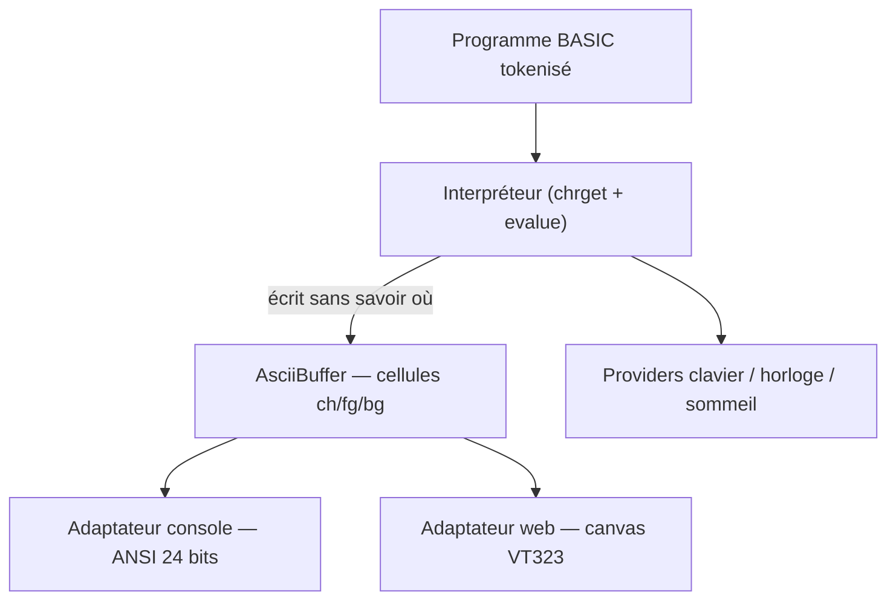

# STAS — STOS ASCII System

Le **STOS BASIC** de François Lionet (Maison-Alfort, 1988, Atari ST) renaît en
pur ASCII. Même langue, mêmes instructions, mêmes erreurs bilingues — mais tout
l'affichage passe par un **buffer de cellules de caractères** au lieu des
traps VDI du STOS. Deux cibles jumelles :

- **console** — terminal ANSI truecolor (Windows Terminal, iTerm, xterm...)
- **navigateur** — canvas HTML en police VT323, intégrable en **iframe**
  (pensé pour AWI-HAXE / AOZ Studio)

Le cœur est du JavaScript pur, zéro dépendance, 100 % indépendant de la
plateforme : il ne sait jamais où il s'affiche.

```
10 print "Salut, le monde !"
20 for i=1 to 5
30 print "tour ";i
40 next i
run
```

## Démarrage rapide

```sh
# console interactive (invite "Ok", comme le STOS)
node packages/stas-console/bin/stas.js

# exécuter un programme
node packages/stas-console/bin/stas.js examples/sinus.bas

# version web
node packages/stas-web/serve.js        # → http://localhost:8080/

# console + mondes AWI (iteration 2 : !shell, enter <monde>, Legal-Fractal)
node packages/stas-world/bin/stas-world.js

# tests (node:test, zéro dépendance)
npm test
```

Node ≥ 18. Aucune installation npm n'est nécessaire : tout est en ESM natif,
les imports relatifs fonctionnent directement.

## Architecture — le nouveau jeu de traps

Le STOS original empilait ses traps maison (#3 FENETRE.S, #5 SPRITES.S,
#6 FLOAT.S, #7 MUSIC.S) au-dessus des traps du système (GEMDOS, VDI, BIOS,
XBIOS). STAS remplace toute la pile par deux injections :



| STOS (1988)                        | STAS                                    |
| ---------------------------------- | --------------------------------------- |
| TRAP #3 → FENETRE.S → VDI → écran  | `AsciiBuffer` → renderer ANSI / canvas  |
| TRAP #13 BIOS → Bconin (clavier)   | provider `readLine` / `inkey` injecté   |
| zone texte tokenisée en mémoire    | `Program` — lignes triées, tokens JS    |
| table `merreur` bilingue EN/FR     | `errors.js` — les 88 messages d'origine |
| tables de tokens BASIC.S L525-694  | `tokens.js` — copie fidèle, codes $80-$FF |

Le monorepo :

```
packages/
  stas-core/        le cœur, plateforme-agnostique
    src/errors.js        88 erreurs bilingues (table merreur)
    src/tokens.js        table des tokens (BASIC.S L525-L694)
    src/tokenizer.js     mise en tokens d'une ligne
    src/ascii-buffer.js  LE nouveau TRAP #3
    src/program.js       lignes numérotées + détokenisation LIST
    src/values.js        valeurs {entier, réel, chaîne}
    src/interpreter.js   boucle d'exécution + évaluateur Pratt
    src/instructions.js  tables d'instructions et de fonctions
    src/stas.js          façade (feedLine / run / execDirect)
  stas-console/     bin/stas.js + renderer ANSI + clavier brut
  stas-web/         index.html + canvas + clavier + postMessage + serve.js
  stas-world/       pont AWI (iteration 2) — shell hote, Legal-Fractal,
                    navigation entre mondes, protocole pour WorldSTAS
examples/           hello, sinus, devine, carres
test/               node --test (52 tests)
```

## La langue V1

**Structures** : `GOTO`, `GOSUB`/`RETURN`/`POP`, `FOR`/`TO`/`STEP`/`NEXT`,
`WHILE`/`WEND`, `REPEAT`/`UNTIL`, `IF`/`THEN`/`ELSE` (forme une-ligne,
`IF x THEN 100` accepté), `ON n GOTO|GOSUB`, `DIM`, `DATA`/`READ`/`RESTORE [n]`,
`REM` / `'`, `:` pour enchaîner.

**Affichage** : `PRINT` / `?` (`;` sans saut de ligne, `,` taquets de 14
colonnes, `TAB(n)`), `CLS`, `LOCATE x,y` (0-based), `PEN n`, `PAPER n`, `HOME`,
`CUP`/`CDOWN`/`CLEFT`/`CRIGHT`, `INC`/`DEC`.

**Entrées** : `INPUT ["texte";] v[,v2...]`, `LINE INPUT`, `INKEY$` (non
bloquant).

**Fonctions maths** : `ABS INT SQR SGN SIN COS TAN ATN EXP LN LOG PI MIN MAX
RND DEG RAD` — `LOG` = base 10 comme le STOS, `DEG`/`RAD` changent le mode
des trigonométriques.

**Fonctions chaînes** : `CHR$ ASC LEN LEFT$ RIGHT$ MID$ STR$ VAL SPACE$
STRING$ INSTR UPPER$ LOWER$ HEX$ BIN$`, plus `TIMER` (compteur 50 Hz),
`TRUE`/`FALSE`.

**Commandes directes** : `RUN [n]`, `LIST [n[,n2]]`, `NEW`, `DEL`/`DELETE`,
`CLEAR`, `WAIT n` (n × 20 ms), `END`, `STOP`, `ERROR n`, `ENGLISH`/`FRANCAIS`.

Tout le reste du vocabulaire STOS (sprites, écrans, musique, fenêtres,
banques...) est **tokenisé fidèlement** mais renvoie l'erreur 20 « Function
not implemented » — la table des tokens est complète, le terrain est prêt.

### Décisions sémantiques (V1)

- `TRUE` vaut **1**, comparaisons rendent 0/1
- `^` associatif **à gauche** — `2^3^2 = 64`, bizarrerie du STOS conservée
- `AND OR XOR` = bit à bit sur 32 bits signés ; `NOT` booléen
- `7/2 → 3.5` mais `8/2 → 4` : division entière quand c'est exact
- mots-clés insensibles à la casse et listés en minuscules ; **variables
  sensibles à la casse**, noms complets, suffixe `$` = chaîne
- taper un numéro seul supprime la ligne (fidèle à l'éditeur du STOS)
- erreurs affichées « Syntax error in line 10 » / « Erreur de syntaxe en
  ligne 10 » selon `ENGLISH`/`FRANCAIS` ; au démarrage, la langue suit
  celle de la machine (français sur une machine française), comme le
  texte d'accueil signé François Lionet

### Limites connues de la V1

- `IF ... THEN ... ELSE` sur une seule ligne (pas de blocs multi-lignes)
- un `DATA` contenant un mot-clé brut (`data wend`) peut troubler le scan
  des structures — le STOS stockait les DATA en texte brut, à revoir
- pas de `DEF FN`, pas de `ON ERROR GOTO`, pas de rotation de sprites
  (le STOS n'en avait pas non plus !)

## Intégration AWI-HAXE (iframe)

La version web s'incruste dans n'importe quel produit via une iframe et un
protocole `postMessage` (voir `packages/stas-web/src/postmessage-api.js`) :

```js
// côté AWI-HAXE (futur BubbleStas.hx, même cycle que BubbleDisplay.hx)
iframe.contentWindow.postMessage(
  { target: "stas", type: "run", source: '10 print "depuis AWI"' }, "*");

window.addEventListener("message", (e) => {
  if (e.data.source !== "stas") return;
  // ready | output{text} | input:request | done | error{message,code}
});
```

## Licence

MIT (voir `LICENSE`) — STOS BASIC © François Lionet. Écrit à la main, sans IA, sur le
clavier mou de l'Atari 520 ST ; celui-ci est écrit avec un peu d'aide, sur un
vrai clavier.
